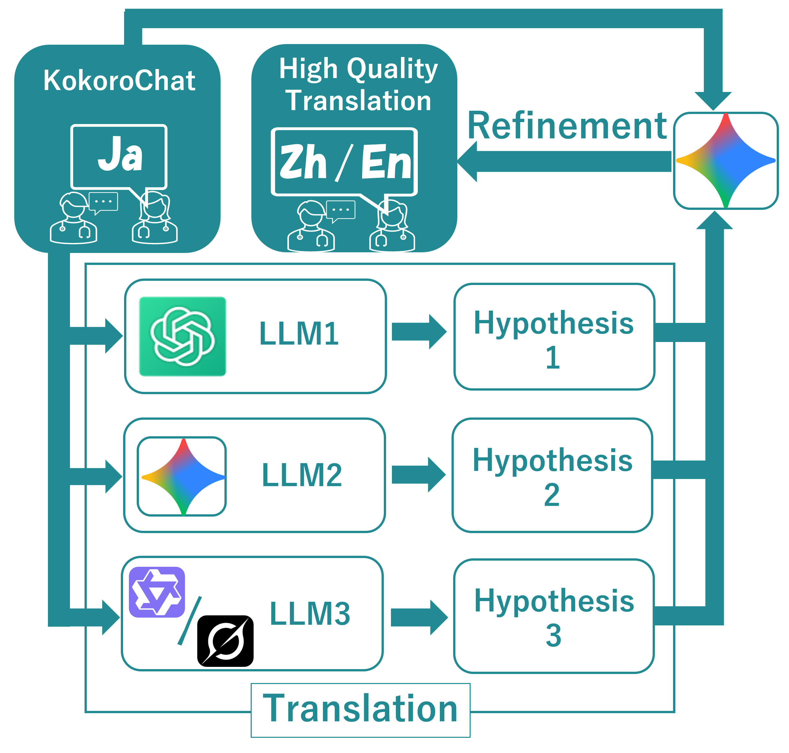

<div align="center">
  
</div>

[](https://creativecommons.org/licenses/by-nc-nd/4.0/)

# Multilingual KokoroChat: A Multi-LLM Ensemble Translation Method for Creating a Multilingual Counseling Dialogue Dataset

This dataset was created by translating [KokoroChat](https://github.com/UEC-InabaLab/KokoroChat), a large-scale manually authored Japanese counseling corpus, into both **English** and **Chinese**. 
We developed and employed a novel **Multi-LLM Ensemble** method. Our approach first generated diverse hypotheses from multiple distinct LLMs. A single LLM then produced a high-quality translation based on an analysis of the respective strengths and weaknesses of all presented hypotheses.

This work has been accepted to the main conference of **LREC 2026**.

## 🤖 LLMs Used for Translation
For the English translation, we selected three models representing the state-of-the-art at the time of manuscript preparation: GPT-5 ([gpt-5-2025-0907](https://developers.openai.com/api/docs/models/gpt-5)), Gemini-2.5-Pro ([gemini-2.5-pro](https://ai.google.dev/gemini-api/docs/models)), Grok-4 ([grok-4-0709](https://docs.x.ai/docs/models)).
For Chinese translation, we replaced Grok-4 with Qwen-Plus ([qwen-plus-2025-07-28](https://www.alibabacloud.com/help/ja/modelstudio/what-is-qwen-llm)).

We selected Gemini-2.5-Pro as the refiner LLM.

## 📊 Dataset Statistics
| Language | Dialogues | Avg. utterances/dialogue |
| --- | --- | --- |
| Japanese (KokoroChat) | 6,589 | 91.2            |
| English  | 6,565     | 91.2                     |
| Chinese  | 6,582     | 91.2                     |

Note that the slight reduction in the number of dialogues for the multilingual versions is due to the exclusion of content that triggered the LLM's safety filters.


## 📁 Directory Structure

```text
Chinese/                 # Chinese translation dialogues by Multi-LLM Ensemble
└── zh*.json

English/                 # English translation dialogues by Multi-LLM Ensemble
└── en*.json

src/                     # Source code
├── TestHyp/             # Hypotheses generated by each LLM (used for refinement)
|      ├── Chinese/
|      |      └── {LLM}4.json
|      └── English/
|             └── {LLM}4.json
|
├── CancelBatchProcess.py  # Script to cancel running batch jobs
├── config.json            # API keys for each LLM
├── Hypothesis_{LLM}.py    # Prompts and code to generate hypotheses with each LLM
├── main.py                # Main entry point to run the experiments
├── Refine_Gemini.py       # Prompt and code to refine translations by integrating 3 hypotheses
└── utils.py               # Shared utility functions
```

The English translation dialogue data is stored in ``English/`` as ``en*.json``, while the Chinese translation dialogue data is stored in ``Chinese/`` as ``zh*.json``.

``src/Hypothesis_{LLM}.py`` contains the prompts and code used to generate hypotheses with each LLM.
``src/Refine_Gemini.py`` contains the prompt and code used to refine translations by integrating 3 hypotheses.

``src/TestHyp/`` contains, for each language, one dialogue of hypotheses generated by each LLM, which are used to reproduce the integration performed in ``src/Refine_Gemini.py.``

If you want to run each file, please execute ``src/main.py`` and specify the file ID to be translated, the LLM to use, and the target language.

## 💬 DataFormat

The table below describes the fields of each utterance object in the `dialogue` array. 

| **Key** | **Type** | **Description** |
| --- | --- | --- |
| `role` | String | Speaker's role (`counselor` or `client`).|
| `time` | String | The timestamp of the utterance in ISO 8601 format.|
| `origin` | String | The original utterance in Japanese.|
| `content` | String | The translated text of `origin` in the target language. |

## 📄 Ciatation

If you use this dataset, please cite the following paper:

```bibtex
@inproceedings{qi2025kokorochat,
  title     = {Multilingual KokoroChat: A Multi-LLM Ensemble Translation Method for Creating a Multilingual Counseling Dialogue Dataset},
  author    = {Ryoma Suzuki and Zhiyang Qi and Michimasa Inaba},
  booktitle = {Proceedings of the Fifteenth Language Resources and Evaluation Conference},
  year      = {2026},
  url       = {https://github.com/UEC-InabaLab/MultilingualKokoroChat}
}
```

## ⚖️ License

Multilingual KokoroChat is released under the [**Creative Commons Attribution-NonCommercial-NoDerivatives 4.0 International (CC BY-NC-ND 4.0)**](https://creativecommons.org/licenses/by-nc-nd/4.0/) license.

[![CC BY-NC-ND 4.0][cc-by-nc-nd-image]][cc-by-nc-nd]

[cc-by-nc-nd]: http://creativecommons.org/licenses/by-nc-nd/4.0/
[cc-by-nc-nd-image]: https://licensebuttons.net/l/by-nc-nd/4.0/88x31.png
[cc-by-nc-nd-shield]: https://img.shields.io/badge/License-CC%20BY--NC--ND%204.0-lightgrey.svg
